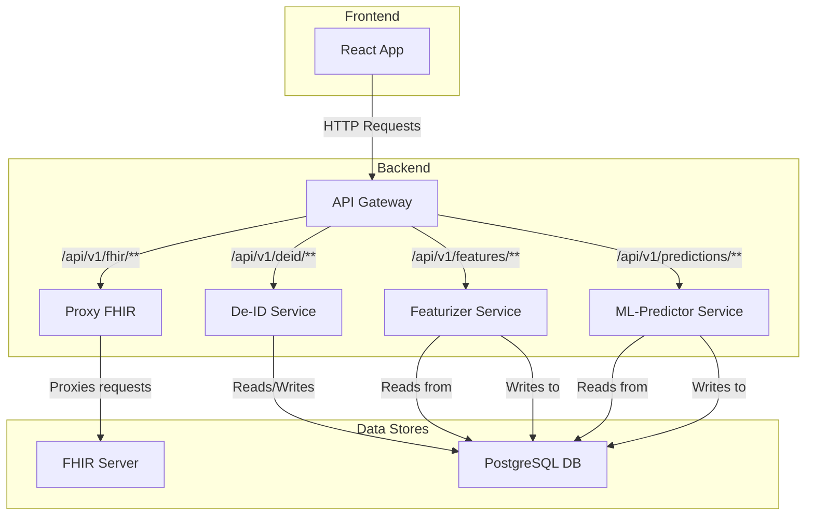

# Project HealthFlow

This project is a microservices-based application for health data processing and prediction. It consists of several services working together to provide a complete solution for analyzing patient data and predicting health risks.

## Architecture and Data Flow

The application follows a microservice architecture, with a central API Gateway routing requests to various backend services. The frontend is a single-page application built with React.



### Data Flow:

1.  **Data Ingestion**: The `Pipeline.jsx` component in the React app can trigger the data processing pipeline.
    *   It first calls the `proxy-fhir` service (via the API gateway) to sync data from a FHIR server.
    *   Then, it calls the `deID` service to anonymize the patient data. The anonymized data is stored in a PostgreSQL database.
2.  **Feature Extraction**: The `featurizer` service is called to process the anonymized data and extract features for the machine learning model. These features are also stored in the database.
3.  **Risk Prediction**: The `ml-predictor` service uses the extracted features to predict health risks for each patient. The predictions are stored in the database.
4.  **Data Visualization**: The React application fetches the processed data (features and predictions) from the `featurizer` and `ml-predictor` services (through the API gateway) to display on the dashboard.

## Frontend Components (`dashboard-web`)

The frontend is a React application that provides a user interface for the HealthFlow platform.

*   **`Dashboard.jsx`**: The main dashboard page. It displays high-level statistics about the patient data, such as total patients, average age, BMI, and cholesterol. It also contains buttons to trigger the feature extraction and risk prediction processes.
*   **`HealthStatus.jsx`**: A page that displays the health status of all the backend microservices.
*   **`PatientList.jsx`**: This component fetches and displays a list of all patients with their features and risk predictions. It uses the `PatientCard.jsx` component to display each patient.
*   **`PatientCard.jsx`**: A card component that shows a summary of a single patient's data, including demographics, vital signs, lab results, and their predicted health risk.
*   **`Pipeline.jsx`**: A utility page that allows a user to run the entire data processing pipeline step-by-step. This is useful for testing and debugging the data flow.
*   **`RiskChart.jsx`**: A reusable chart component that displays the distribution of health risks across the patient population.
*   **`StatsCard.jsx`**: A reusable card for displaying a single statistic on the dashboard.
*   **`services/api.js`**: This file contains all the functions for making API calls to the backend services via the API gateway.

## Backend Services

### `api-gateway` (Spring Cloud Gateway)

*   **Port**: 8080
*   **Description**: The single entry point for all frontend requests. It routes requests to the appropriate microservice based on the URL path.
*   **Routes**:
    *   `/api/v1/fhir/**` -> `proxy-fhir` (port 8081)
    *   `/api/v1/deid/**` -> `deID-service` (port 5000)
    *   `/api/v1/features/**` -> `featurizer-service` (port 5001)
    *   `/api/v1/predictions/**` -> `ml-predictor-service` (port 5002)

### `proxy-fhir` (Spring Boot)

*   **Port**: 8081
*   **Description**: A proxy service that interacts with a FHIR server to fetch patient data.

### `deID` (Python/Flask)

*   **Port**: 5000
*   **Description**: This service is responsible for anonymizing patient data to protect privacy.

### `featurizer` (Python/Flask)

*   **Port**: 5001
*   **Description**: This service takes the anonymized data and extracts relevant features for the machine learning model.

### `ml-predictor` (Python/Flask)

*   **Port**: 5002
    **Description**: This service uses a pre-trained machine learning model (`xgboost_readmission_model.ubj`) to predict health risks based on the extracted features.

## Building and Running

Here are the instructions for building and running each service:

### `api-gateway` (Java/Spring Boot)

1.  Navigate to the `api-gateway` directory.
2.  Build the project using Maven:
    ```bash
    ./mvnw clean install
    ```
3.  Run the application:
    ```bash
    ./mvnw spring-boot:run
    ```
    Alternatively, you can run the main application class from your IDE.

### `proxy-fhir` (Java/Spring Boot)

1.  Navigate to the `proxy-fhir` directory.
2.  Build the project using Maven:
    ```bash
    ./mvnw clean install
    ```
3.  Run the application:
    ```bash
    ./mvnw spring-boot:run
    ```
    Alternatively, you can run the main application class from your IDE.

### Python Services (`deID`, `featurizer`, `ml-predictor`)

For each of the Python services:

1.  Navigate to the service's directory (e.g., `deID`).
2.  Create and activate a virtual environment:
    ```bash
    python -m venv venv
    source venv/bin/activate # on Windows use `venv\Scripts\activate`
    ```
3.  Install the dependencies:
    ```bash
    pip install -r requirements.txt
    ```
4.  Run the application:
    ```bash
    python app.py
    ```

### `dashboard-web` (React)

1.  Navigate to the `dashboard-web` directory.
2.  Install the dependencies:
    ```bash
    npm install
    ```
3.  Run the development server:
    ```bash
    npm run dev
    ```

## Development Conventions

*   **Java**: The Java services use Spring Boot and Maven for dependency management and building.
*   **Python**: The Python services use Flask and manage dependencies with `pip` and `requirements.txt`. They are structured with blueprints for routing.
*   **Frontend**: The frontend is a React application built with Vite. It uses ESLint for linting.
