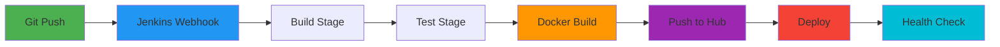

# HealthFlow CI/CD Pipeline - Complete Guide

## 🚀 Quick Links

- **5-Minute Setup**: [docs/QUICKSTART-JENKINS.md](docs/QUICKSTART-JENKINS.md)
- **Complete Guide**: [docs/jenkins-setup-guide.md](docs/jenkins-setup-guide.md)
- **Implementation Details**: See walkthrough artifact in `.gemini/antigravity/brain/`

---

## 📦 What's Included

This repository now includes a complete **Jenkins CI/CD pipeline** with:

### ✅ Core Files
- **`Jenkinsfile`** - Declarative pipeline with 9 automated stages
- **`docker-compose.yml`** - Updated with Docker Hub registry support
- **`deploy.sh`** - Linux/Mac deployment script
- **`deploy.ps1`** - Windows PowerShell deployment script

### ✅ Documentation
- **`docs/jenkins-setup-guide.md`** - Comprehensive 15-page setup guide
- **`docs/QUICKSTART-JENKINS.md`** - 5-minute quick start guide

---

## 🎯 Features

### Automated CI/CD Workflow
```
Push to GitHub → Jenkins Build → Tests → Docker Build → Push to Registry → Deploy → Health Check
```

### Key Capabilities
- ✅ **GitHub Webhook Integration** - Automatic builds on push to `main`
- ✅ **Parallel Builds** - Java, Python, and React services build simultaneously
- ✅ **Automated Testing** - Unit tests for Java, linting for React
- ✅ **Docker Hub Integration** - Images pushed to `taoufikjeta/healthflow-*`
- ✅ **Automated Deployment** - docker-compose deployment after successful build
- ✅ **Health Monitoring** - Automatic health checks for all 8 services
- ✅ **Smart Version Tagging** - Images tagged with build number and commit hash

---

## ⚡ Quick Start

### Prerequisites
- Jenkins 2.x with required plugins (see setup guide)
- Docker & Docker Compose
- GitHub account
- Docker Hub account: `taoufikjeta`

### Setup (5 Minutes)

1. **Install Jenkins Plugins**
   - Git, GitHub, Pipeline, Docker Pipeline, Credentials Binding

2. **Configure Credentials**
   - `github-credentials` - GitHub PAT
   - `dockerhub-credentials` - Docker Hub login (taoufikjeta)
   - `postgres-password` - Database password

3. **Create Pipeline Job**
   - New Pipeline job in Jenkins
   - Point to this repository
   - Select `Jenkinsfile` as script path

4. **Setup GitHub Webhook**
   - Add webhook: `http://YOUR_JENKINS:8080/github-webhook/`

5. **Build & Deploy**
   - Click "Build Now" or push to `main` branch

**Detailed instructions**: [docs/QUICKSTART-JENKINS.md](docs/QUICKSTART-JENKINS.md)

---

## 🏗️ Architecture

### Services Pipeline Flow



### Microservices
| Service | Technology | Port | Docker Hub Image |
|---------|-----------|------|------------------|
| api-gateway | Java 17/Spring | 8080 | taoufikjeta/healthflow-api-gateway |
| proxy-fhir | Java 17/Spring | 8081 | taoufikjeta/healthflow-proxy-fhir |
| deID | Python 3.11/Flask | 5000 | taoufikjeta/healthflow-deid |
| featurizer | Python 3.11/Flask | 5001 | taoufikjeta/healthflow-featurizer |
| ml-predictor | Python 3.11/Flask | 5002 | taoufikjeta/healthflow-ml-predictor |
| score-api | Python 3.12/FastAPI | 5003 | taoufikjeta/healthflow-score-api |
| audit-fairness | Python 3.12/Flask | 5004 | taoufikjeta/healthflow-audit-fairness |
| dashboard-web | React/Vite | 3000 | taoufikjeta/healthflow-dashboard-web |

---

## 📊 Pipeline Stages

1. **Checkout** - Clone repository from GitHub
2. **Build Java Services** - Maven compile for Spring Boot services
3. **Build React Frontend** - npm build for production
4. **Validate Python Services** - Check dependencies
5. **Run Tests** - Unit tests and linting (parallel)
6. **Build Docker Images** - Create containers for all services (parallel)
7. **Push Docker Images** - Upload to Docker Hub
8. **Deploy** - docker-compose deployment
9. **Health Check** - Verify all services are running

**Total Time**: ~15-20 minutes

---

## 🛠️ Manual Deployment

### Using Deployment Scripts

**Linux/Mac:**
```bash
chmod +x deploy.sh
./deploy.sh
```

**Windows:**
```powershell
powershell -ExecutionPolicy Bypass -File deploy.ps1
```

### Using Docker Compose

**Local build:**
```bash
docker-compose build
docker-compose up -d
```

**Pull from registry:**
```bash
export DOCKER_USERNAME=taoufikjeta
export IMAGE_TAG=latest
docker-compose pull
docker-compose up -d
```

---

## 🔍 Monitoring

### Check Service Health

```bash
# All services
docker-compose ps

# Individual logs
docker-compose logs -f api-gateway
docker-compose logs -f ml-predictor

# Health endpoints
curl http://localhost:8085/actuator/health  # API Gateway
curl http://localhost:5000/api/v1/health    # DeID
curl http://localhost:5001/api/v1/health    # Featurizer
curl http://localhost:5002/api/v1/health    # ML Predictor
curl http://localhost:5003/health           # Score API
curl http://localhost:5004/api/v1/health    # Audit Fairness
```

### Access Services

- **Dashboard**: http://localhost:3002
- **API Gateway**: http://localhost:8085
- **PostgreSQL**: localhost:5433

---

## 🔐 Required Credentials

Configure these in Jenkins (Manage Jenkins → Manage Credentials):

| ID | Type | Purpose | Value |
|----|------|---------|-------|
| `github-credentials` | Username/Password | GitHub access | Your GitHub PAT |
| `dockerhub-credentials` | Username/Password | Docker Hub | taoufikjeta + password |
| `postgres-password` | Secret Text | Database | qwerty |

---

## 📝 Important Notes

### ML Model Configuration
- The ML Predictor service uses: `xgboost_readmission_pack_100k.joblib`
- Model is mounted as volume in docker-compose
- Ensure this file exists in project root

### Branch Strategy
- Only `main` branch triggers deployment
- Create feature branches for development
- Merge to `main` for production deployment

### Image Versioning
Images are tagged with:
- `latest` - Most recent build from main
- `main-BUILD_NUMBER-COMMIT_HASH` - Specific version for rollback

---

## 🆘 Troubleshooting

### Build Fails
```bash
# Check Jenkins console output
# View service logs
docker-compose logs SERVICE_NAME
```

### Webhook Not Triggering
1. Check GitHub webhook deliveries
2. Verify Jenkins is publicly accessible
3. Use ngrok for local testing: `ngrok http 8080`

### Docker Permission Denied
```bash
# Add Jenkins user to docker group
sudo usermod -aG docker jenkins
sudo systemctl restart jenkins
```

**More solutions**: [docs/jenkins-setup-guide.md#troubleshooting](docs/jenkins-setup-guide.md)

---

## 📚 Documentation

- **Quick Start** (5 min): [docs/QUICKSTART-JENKINS.md](docs/QUICKSTART-JENKINS.md)
- **Full Setup Guide**: [docs/jenkins-setup-guide.md](docs/jenkins-setup-guide.md)
- **Jenkins Docs**: https://www.jenkins.io/doc/
- **Docker Compose Docs**: https://docs.docker.com/compose/

---

## 🎓 Next Steps

### Basic
1. Configure Jenkins credentials
2. Create pipeline job
3. Setup GitHub webhook
4. Run first build

### Advanced
- Multi-environment support (dev/staging/prod)
- Kubernetes deployment
- Integration tests
- Security scanning (Trivy, Snyk)
- Slack/Email notifications
- Performance monitoring

---

## 📜 License

This CI/CD configuration is part of the HealthFlow project.

---

**Built with ❤️ using Jenkins, Docker, and GitHub Actions**

For issues or questions, check the troubleshooting guide or Jenkins logs.
