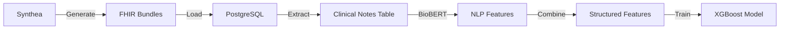

# Synthea Data Generation Guide

This guide explains how to generate synthetic patient data with clinical notes using Synthea.

## Quick Start

```bash
# 1. Generate 1000 patients with clinical notes
cd scripts
chmod +x generate_synthea_data.sh
./generate_synthea_data.sh 1000

# 2. Load data into PostgreSQL
python3 load_synthea_to_db.py ../synthea_output/fhir

# 3. Extract features with BioBERT
cd ../featurizer
python extract_features_with_nlp.py
```

## What Synthea Generates

Synthea creates realistic FHIR bundles including:

- **Patient demographics**: Age, gender, race, address
- **Conditions**: ICD-10 coded diagnoses
- **Medications**: RxNorm coded prescriptions
- **Observations**: Vital signs, lab results
- **Procedures**: SNOMED coded procedures
- **Clinical Notes**: Realistic physician notes in DocumentReference resources

### Sample Clinical Note

```
Patient presents with acute exacerbation of congestive heart failure.

History of Present Illness:
72-year-old male with history of CHF (EF 25%), diabetes mellitus type 2,
and hypertension presents with 3-day history of progressive dyspnea and
lower extremity edema.

Past Medical History:
- Congestive heart failure with reduced ejection fraction
- Type 2 diabetes mellitus
- Essential hypertension
- Hyperlipidemia

Current Medications:
- Furosemide 40mg PO BID
- Metoprolol 50mg PO BID
- Lisinopril 20mg PO daily
- Metformin 1000mg PO BID
- Atorvastatin 40mg PO daily

Physical Examination:
- BP: 145/88, HR: 92, RR: 22, O2 Sat: 94% on RA
- Cardiovascular: S1, S2, S3 gallop present
- Respiratory: Bilateral crackles at bases
- Extremities: 2+ pitting edema bilaterally

Assessment and Plan:
Acute decompensated heart failure. Increase furosemide to 80mg BID.
Monitor daily weights. Follow up in 1 week.
```

## Data Flow with Clinical Notes



## Configuration Options

### Generate More Patients

```bash
# Generate 10,000 patients (takes ~30 minutes)
./generate_synthea_data.sh 10000
```

### Customize Demographics

Edit Synthea configuration to control:

- Age distribution
- Gender ratio
- Disease prevalence
- Geographic location

### Enable/Disable Clinical Notes

In `synthea.properties`:

```properties
exporter.clinical_note.export = true
exporter.clinical_note.fhir.export = true
```

## Database Schema

### `clinical_notes` Table

| Column       | Type      | Description          |
| ------------ | --------- | -------------------- |
| id           | SERIAL    | Primary key          |
| patient_id   | VARCHAR   | FHIR Patient ID      |
| encounter_id | VARCHAR   | Associated encounter |
| note_date    | TIMESTAMP | Note creation date   |
| note_type    | VARCHAR   | Type of note         |
| note_text    | TEXT      | Full clinical note   |

### `fhir_bundles` Table

| Column      | Type    | Description          |
| ----------- | ------- | -------------------- |
| id          | SERIAL  | Primary key          |
| patient_id  | VARCHAR | FHIR Patient ID      |
| bundle_data | JSONB   | Complete FHIR bundle |

## Expected Results

With clinical notes, expect:

- **Accuracy improvement**: 77% → 82-85%
- **AUC improvement**: 87% → 90-93%
- **Additional features**: +15 NLP-derived features
- **Better risk stratification**: More granular predictions

## Troubleshooting

### Java Not Found

```bash
# Install Java 11+
brew install openjdk@11  # macOS
sudo apt install openjdk-11-jdk  # Ubuntu
```

### Out of Memory

```bash
# Increase Java heap size
java -Xmx4g -jar synthea-with-dependencies.jar -p 1000
```

### No Clinical Notes Generated

Check Synthea version supports clinical notes (v2.7.0+)

## Next Steps

After loading data:

1. **Verify data**: Check `clinical_notes` table
2. **Test BioBERT**: Run NLP extraction on sample notes
3. **Extract features**: Combine structured + NLP features
4. **Retrain model**: Use enhanced feature set
5. **Compare results**: Evaluate accuracy improvement
