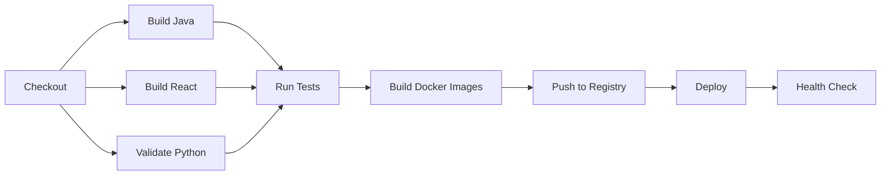

# Jenkins CI/CD Setup Guide for HealthFlow

## 🎯 Overview

This guide will help you set up a complete CI/CD pipeline for the HealthFlow microservices project using Jenkins. The pipeline automates building, testing, and deploying 8 containerized services.

## 📋 Prerequisites

- Jenkins 2.x or higher installed
- Docker installed on Jenkins server
- Docker Compose installed
- Git installed
- Java 17 (for Maven builds)
- Node.js 20+ (for React builds)
- GitHub account with repository access
- Docker Hub account (username: taoufikjeta)

## 🔌 Required Jenkins Plugins

Install the following plugins via **Manage Jenkins** → **Manage Plugins**:

### Essential Plugins
1. **Git Plugin** - For Git repository integration
2. **GitHub Plugin** - For GitHub webhook support
3. **Pipeline** - For declarative pipeline support
4. **Docker Pipeline** - For Docker integration
5. **Credentials Binding** - For secure credential management

### Recommended Plugins
6. **Blue Ocean** - Modern UI for pipelines (optional but recommended)
7. **JUnit Plugin** - For test result publishing
8. **Timestamper** - For timestamped console output
9. **Workspace Cleanup** - For cleaning workspaces

### Installation Command (via Jenkins CLI)
```bash
java -jar jenkins-cli.jar -s http://localhost:8080/ install-plugin \
  git github workflow-aggregator docker-workflow credentials-binding \
  blueocean junit timestamper ws-cleanup
```

## 🔐 Configure Credentials

Navigate to **Manage Jenkins** → **Manage Credentials** → **(global)** → **Add Credentials**

### 1. GitHub Credentials
- **Kind**: Username with password
- **Username**: Your GitHub username
- **Password**: GitHub Personal Access Token (PAT)
  - Generate at: https://github.com/settings/tokens
  - Required scopes: `repo`, `admin:repo_hook`
- **ID**: `github-credentials`
- **Description**: GitHub PAT for HealthFlow

### 2. Docker Hub Credentials
- **Kind**: Username with password
- **Username**: `taoufikjeta`
- **Password**: Your Docker Hub password/token
- **ID**: `dockerhub-credentials`
- **Description**: Docker Hub credentials

### 3. PostgreSQL Password
- **Kind**: Secret text
- **Secret**: `qwerty` (or your actual password)
- **ID**: `postgres-password`
- **Description**: PostgreSQL database password

## 📁 Create Jenkins Pipeline Job

### Step 1: Create New Item
1. Click **New Item** in Jenkins dashboard
2. Enter name: `HealthFlow-Pipeline`
3. Select **Pipeline**
4. Click **OK**

### Step 2: Configure General Settings
In the configuration page:

1. **Description**: `CI/CD Pipeline for HealthFlow Microservices`

2. **Enable**: ✅ **GitHub project**
   - Project URL: `https://github.com/testalgms/HealthFlowFinal/`

3. **Enable**: ✅ **Discard old builds**
   - Strategy: Log Rotation
   - Max # of builds to keep: `10`

### Step 3: Configure Build Triggers

✅ **GitHub hook trigger for GITScm polling**

This enables webhook-based builds when you push to GitHub.

### Step 4: Configure Pipeline

- **Definition**: Pipeline script from SCM
- **SCM**: Git
  - **Repository URL**: `https://github.com/testalgms/HealthFlowFinal.git`
  - **Credentials**: Select `github-credentials`
  - **Branch Specifier**: `*/main`
- **Script Path**: `Jenkinsfile`
- **Lightweight checkout**: ✅ (recommended for faster checkouts)

### Step 5: Save Configuration

Click **Save** at the bottom of the page.

## 🔗 Configure GitHub Webhook

### Step 1: Go to GitHub Repository Settings
1. Navigate to: `https://github.com/testalgms/HealthFlowFinal/settings/hooks`
2. Click **Add webhook**

### Step 2: Configure Webhook
- **Payload URL**: `http://YOUR_JENKINS_URL:8080/github-webhook/`
  - Example: `http://jenkins.yourdomain.com:8080/github-webhook/`
  - For local testing: `http://YOUR_PUBLIC_IP:8080/github-webhook/`
- **Content type**: `application/json`
- **Secret**: Leave empty (or configure if needed)
- **Which events**: 
  - ✅ **Just the push event**
- **Active**: ✅ Enabled

### Step 3: Save Webhook

Click **Add webhook**

> [!IMPORTANT]
> If Jenkins is running locally and not publicly accessible, you'll need:
> - A public domain/IP, OR
> - **ngrok** for tunneling: `ngrok http 8080`
> - Use the ngrok URL in webhook: `https://YOUR-ID.ngrok.io/github-webhook/`

## 🚀 Running the Pipeline

### Manual Trigger
1. Go to Jenkins dashboard
2. Click on `HealthFlow-Pipeline`
3. Click **Build Now**

### Automatic Trigger
- Push code to `main` branch
- GitHub webhook will automatically trigger the build

## 📊 Pipeline Stages Explained

The pipeline consists of the following stages:



### 1. **Checkout** (30s)
- Clones repository from GitHub
- Displays build information

### 2. **Build Java Services** (2-3 min)
- Builds `api-gateway` and `proxy-fhir` with Maven
- Compiles JARs for Docker images
- Archives artifacts

### 3. **Build React Frontend** (1-2 min)
- Installs dependencies with `npm ci`
- Builds production bundle
- Archives `dist/` folder

### 4. **Validate Python Services** (10s)
- Checks `requirements.txt` exists for all Python services

### 5. **Run Tests** (2-4 min, parallel)
- Runs Maven tests for Java services
- Runs linting for React frontend
- Publishes test results

### 6. **Build Docker Images** (5-8 min, parallel)
- Builds Docker images for all 8 services
- Tags with version: `${BRANCH}-${BUILD_NUMBER}-${COMMIT}`

### 7. **Push Docker Images** (3-5 min)
- Pushes to Docker Hub registry: `taoufikjeta/healthflow-*`
- Tags both specific version and `latest`

### 8. **Deploy** (1-2 min)
- Pulls latest images
- Stops existing containers
- Starts new containers with `docker-compose`

### 9. **Health Check** (30s)
- Verifies all 8 services are responding
- Checks HTTP health endpoints

**Total Pipeline Time**: ~15-20 minutes

## 🏥 Accessing Deployed Services

After successful deployment:

| Service | URL | Description |
|---------|-----|-------------|
| **Dashboard** | http://localhost:3002 | React frontend |
| **API Gateway** | http://localhost:8085 | Central API gateway |
| **Proxy FHIR** | http://localhost:8081 | FHIR proxy service |
| **DeID** | http://localhost:5000 | De-identification service |
| **Featurizer** | http://localhost:5001 | Feature extraction |
| **ML Predictor** | http://localhost:5002 | ML predictions |
| **Score API** | http://localhost:5003 | Risk scoring |
| **Audit Fairness** | http://localhost:5004 | Fairness auditing |
| **PostgreSQL** | localhost:5433 | Database |

## 🔍 Monitoring & Troubleshooting

### View Build Logs
```bash
# In Jenkins UI
Click on build number → Console Output
```

### View Docker Logs
```bash
# All services
docker-compose logs

# Specific service
docker-compose logs api-gateway
docker-compose logs ml-predictor

# Follow logs
docker-compose logs -f
```

### Check Service Health
```bash
# API Gateway
curl http://localhost:8085/actuator/health

# Python services
curl http://localhost:5000/api/v1/health
curl http://localhost:5001/api/v1/health
curl http://localhost:5002/api/v1/health
curl http://localhost:5004/api/v1/health

# Score API
curl http://localhost:5003/health
```

### Common Issues

#### ❌ Docker build fails: Permission denied
**Solution**: Add Jenkins user to docker group
```bash
sudo usermod -aG docker jenkins
sudo systemctl restart jenkins
```

#### ❌ Maven build fails: JAVA_HOME not set
**Solution**: Configure Java in Jenkins
1. Manage Jenkins → Global Tool Configuration
2. Add JDK → Install automatically → Java 17

#### ❌ npm build fails: Out of memory
**Solution**: Increase Node.js heap size
```bash
# In Jenkinsfile, add before npm build:
export NODE_OPTIONS="--max-old-space-size=4096"
```

#### ❌ Docker push fails: Authentication required
**Solution**: Verify Docker Hub credentials
```bash
# Test login manually
docker login -u taoufikjeta
```

#### ❌ Webhook not triggering
**Solution**: Check webhook delivery in GitHub
1. Go to repository → Settings → Webhooks
2. Click on webhook → Recent Deliveries
3. Check for errors

## 🔄 Updating the Pipeline

### Modify Jenkinsfile
1. Edit `Jenkinsfile` in repository
2. Commit and push to GitHub
3. Next build will use updated pipeline

### Update Docker Images
- Images are automatically built on each push to `main`
- Tagged with: `taoufikjeta/healthflow-SERVICE:latest`
- Version-tagged: `taoufikjeta/healthflow-SERVICE:main-BUILD-COMMIT`

## 📝 Best Practices

1. **Always test locally first**
   ```bash
   # Build Docker images
   docker-compose build
   
   # Run services
   docker-compose up -d
   ```

2. **Use feature branches**
   - Create feature branches for development
   - Only `main` branch triggers deployment

3. **Monitor build times**
   - Check Jenkins Blue Ocean for visualizations
   - Optimize slow stages

4. **Regular cleanup**
   ```bash
   # Remove old images
   docker image prune -a -f --filter "until=168h"
   
   # Clean build workspace
   docker-compose down -v
   ```

## 🎓 Next Steps

### Advanced Configuration (Optional)

1. **Multi-branch Pipeline**
   - Support dev/staging/production branches
   - Different deployment targets per branch

2. **Kubernetes Deployment**
   - Replace docker-compose with K8s manifests
   - Use Helm charts

3. **Automated Testing**
   - Add integration tests
   - Performance testing
   - Security scanning (Trivy, Snyk)

4. **Notifications**
   - Slack integration
   - Email notifications
   - GitHub status checks

5. **Artifact Repository**
   - Use Nexus or Artifactory
   - Store JARs and Docker images

## 📞 Support

- **Jenkins Documentation**: https://www.jenkins.io/doc/
- **Docker Documentation**: https://docs.docker.com/
- **Pipeline Syntax**: https://www.jenkins.io/doc/book/pipeline/syntax/

---

**Created by**: Antigravity AI  
**Last Updated**: 2025-12-22
