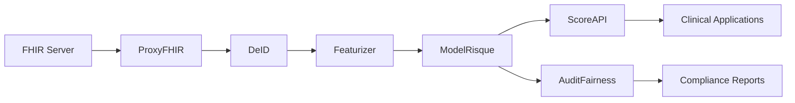

# HealthFlow-MS: FHIR Analysis and Readmission Prediction Platform

## Executive Summary

HealthFlow-MS is a microservices-based healthcare analytics platform that leverages FHIR (Fast Healthcare Interoperability Resources) standards to predict patient readmission risks. By combining advanced machine learning, natural language processing, and strict privacy compliance, the platform enables healthcare providers to identify high-risk patients, improve care planning, and reduce preventable hospital readmissions.

---

## Context and Problem Statement

### The Challenge

Modern healthcare systems face a critical challenge: **preventable patient readmissions** within a short timeframe after discharge. This issue creates:

- **Financial burden**: Increased costs for healthcare institutions
- **Resource strain**: Hospital overcrowding and capacity issues
- **Quality concerns**: Questions about the adequacy of initial care
- **Patient impact**: Compromised patient outcomes and satisfaction

### The Opportunity

With FHIR becoming the global standard for structured medical data exchange, hospitals now have the opportunity to:

- Leverage standardized health data for predictive analytics
- Implement data-driven clinical decision support
- Maintain compliance with privacy regulations (GDPR, HIPAA)
- Improve patient outcomes through early intervention

---

## Project Objectives

Deploy a **modular microservices architecture** to:

1. **Extract, clean, and transform** FHIR data into actionable features
2. **Predict short-term readmission risk** for individual patients
3. **Explain and audit** model decisions to ensure fairness and compliance
4. **Support clinical decision-making** with transparent, evidence-based insights

### Expected Outcomes

- ✅ Reduction in preventable readmissions through early warning alerts
- ✅ Seamless integration with hospital FHIR systems
- ✅ Full auditability and transparency of predictive models
- ✅ Compliance with ethical and regulatory requirements
- ✅ Open, modular platform ready for academic publication (SoftwareX)

---

## System Architecture

The platform consists of six specialized microservices, each handling a distinct aspect of the data processing and prediction pipeline:

---

## Microservices Overview

### 1. ProxyFHIR - FHIR Data Integration

**Role**: Connects to hospital FHIR servers and retrieves standardized medical resources

**Technology Stack**:

- Java
- HAPI FHIR
- PostgreSQL

**Functionality**:

- Serves as the interoperability layer between HealthFlow and hospital systems
- Synchronizes patient data, observations, diagnoses, medications, and procedures via REST API
- Stores FHIR Bundles in PostgreSQL for downstream processing
- Ensures data integrity and standardization

---

### 2. DeID - Data Anonymization

**Role**: Anonymizes personal and sensitive health information before processing

**Technology Stack**:

- Python
- Faker library
- PostgreSQL

**Functionality**:

- Removes or replaces direct identifiers (names, addresses, patient IDs) with pseudonyms
- Implements temporal encoding to preserve time-based patterns
- Strips unnecessary sensitive data not required for prediction
- Ensures GDPR and HIPAA compliance

---

### 3. Featurizer - Feature Engineering

**Role**: Extracts relevant variables from clinical notes and structured measurements

**Technology Stack**:

- Python
- BioBERT (Biomedical NLP)
- spaCy
- PostgreSQL

**Functionality**:

- Combines NLP for medical entity recognition with statistical feature extraction
- Processes unstructured clinical notes to identify key medical concepts
- Summarizes patient history, treatments, comorbidities, and vital signs
- Detects outlier values in lab results
- Generates a comprehensive patient feature table for model training

---

### 4. ModelRisque - Risk Prediction Engine

**Role**: Calculates readmission risk scores using supervised machine learning

**Technology Stack**:

- Python
- XGBoost
- SHAP (SHapley Additive exPlanations)
- PostgreSQL

**Functionality**:

- Trains on historical FHIR data to learn readmission patterns
- Generates 30-day readmission probability scores (0-1 scale)
- Provides local explanations (SHAP values) for each prediction
- Enables clinicians to understand which factors contribute to risk

---

### 5. ScoreAPI - Prediction Service Interface

**Role**: Exposes risk scores, explanations, and features via secure REST API

**Technology Stack**:

- FastAPI
- JWT Authentication
- PostgreSQL

**Functionality**:

- Provides secure API endpoints for querying patient risk scores
- Supports filtering by patient ID, discharge date, or clinical service
- Enables integration with EHR systems, mobile clinical apps, and alert systems
- Implements role-based access control

---

### 6. AuditFairness - Model Fairness Monitoring

**Role**: Verifies that model predictions are fair and non-discriminatory

**Technology Stack**:

- EvidentlyAI
- Python
- Dash (interactive dashboards)
- PostgreSQL

**Functionality**:

- Analyzes potential biases across demographic groups (age, gender, ethnicity)
- Evaluates fairness metrics and inter-group equity
- Monitors model drift over time
- Generates compliance reports for regulatory audits
- Ensures ethical AI deployment in healthcare

---

## Data Flow Pipeline

1. **Data Ingestion**: ProxyFHIR retrieves patient data from hospital FHIR servers
2. **Anonymization**: DeID removes personally identifiable information
3. **Feature Extraction**: Featurizer processes clinical notes and structured data
4. **Risk Prediction**: ModelRisque generates readmission probability scores
5. **API Exposure**: ScoreAPI makes predictions available to clinical systems
6. **Continuous Monitoring**: AuditFairness ensures ongoing model fairness

---

## Key Benefits

### For Healthcare Providers

- **Proactive Care**: Identify high-risk patients before discharge
- **Resource Optimization**: Allocate follow-up care resources efficiently
- **Quality Improvement**: Reduce preventable readmissions and improve outcomes

### For Patients

- **Better Outcomes**: Receive targeted interventions based on individual risk
- **Privacy Protection**: Benefit from advanced analytics while maintaining confidentiality

### For Healthcare Systems

- **Cost Reduction**: Decrease expenses associated with preventable readmissions
- **Regulatory Compliance**: Meet GDPR, HIPAA, and ethical AI requirements
- **Interoperability**: Seamless integration with existing FHIR infrastructure

---

## Technical Highlights

- **Modular Architecture**: Each microservice can be developed, deployed, and scaled independently
- **FHIR Compliance**: Built on international healthcare data standards
- **Explainable AI**: SHAP-based explanations ensure transparency
- **Privacy-First Design**: Anonymization before any analytics processing
- **Fairness Monitoring**: Continuous bias detection and mitigation
- **Production-Ready**: Designed for real-world clinical deployment

---

## Project Team

**Academic Supervisors**:

- Pr. Oumayma OUEDRHIRI (O.ouedrhiri@emsi.ma)
- Pr. Hiba TABBAA (H.Tabbaa@emsi.ma)
- Pr. Mohamed LACHGAR (lachgar.m@gmail.com)

---

## Future Directions

- Integration with additional FHIR resources (imaging, genomics)
- Real-time prediction updates as new patient data arrives
- Multi-hospital deployment and federated learning
- Mobile clinical decision support applications
- Publication in SoftwareX journal

---

_This platform represents a comprehensive approach to predictive healthcare analytics, combining cutting-edge AI with strict ethical and regulatory compliance to improve patient outcomes while respecting privacy and fairness._
